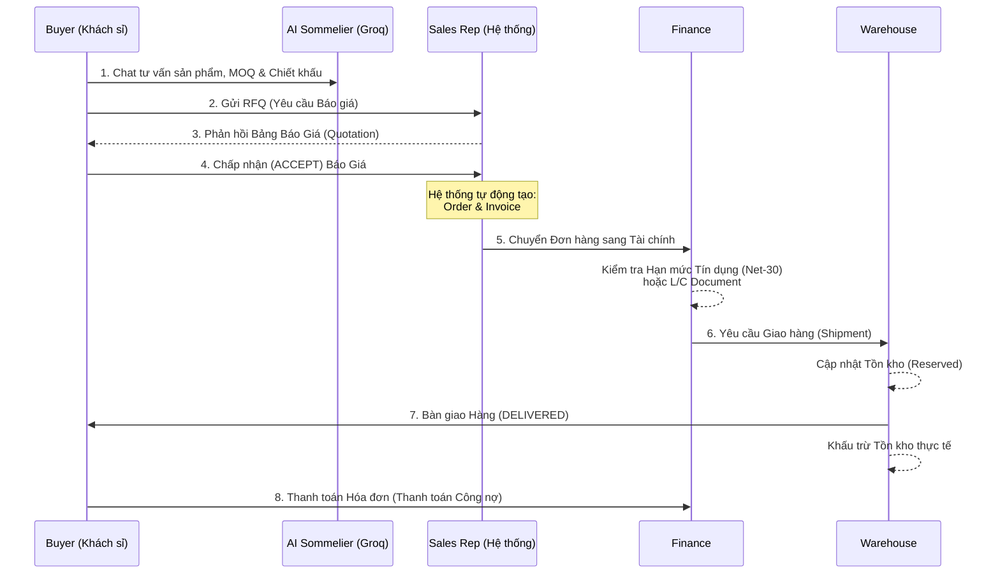

# Báo cáo Audit Kiến trúc & Luồng Nghiệp vụ Backend

Hệ thống **RuuBusiness** được thiết kế dưới dạng một nền tảng thương mại điện tử **B2B** (Business-to-Business) dành cho việc bán buôn Rượu vang & Rượu mạnh. Backend sử dụng kiến trúc nguyên khối (Monolith) với Node.js, Express và cơ sở dữ liệu PostgreSQL.

Dưới đây là sơ đồ luồng dữ liệu toàn diện và các module chính đã được audit:

## 1. Kiến trúc tổng thể (Architecture)

- **Framework**: Node.js + Express.js.
- **Database**: PostgreSQL (Được host trên Neon DB).
- **Authentication**: JWT (JSON Web Tokens) với Role-Based Access Control (RBAC). Các quyền hạn bao gồm `PLATFORM_ADMIN`, `COMPANY_ADMIN`, `BUYER_REP`, `SALES_REP`, `FINANCE_OFFICER`, v.v.
- **AI Integration**: Tích hợp mô hình AI LLM Llama-3.3 (thông qua **Groq Cloud API**) đóng vai trò *AI Sommelier* để tư vấn tự động.

## 2. Luồng Nghiệp vụ Cốt lõi (B2B E-Commerce Flow)

Hệ thống xoay quanh luồng mua bán sỉ khối lượng lớn với cơ chế mặc cả giá (Negotiation/RFQ) và Tín dụng trả sau (Net-30).

## 3. Phân tích chi tiết các Controllers (Modules)

### 3.1. Auth & Users (`authController.js`, `userController.js`, `companyController.js`)
- Quản lý công ty (Buyer / Seller) và nhân viên trực thuộc.
- Hỗ trợ cơ chế JWT Token truyền qua Header `Authorization: Bearer <token>`.
- Mỗi user gắn liền với một `company_id`. Buyer không thể nhìn thấy thông tin của Buyer khác.

### 3.2. Quản lý Sản phẩm (`productController.js`)
- Cung cấp danh mục sản phẩm cao cấp (Vang, Whisky, Cognac, Champagne).
- **B2B Tiered Pricing**: Hệ thống bảng giá phân cấp. Ví dụ: Mua dưới 10 thùng (Tier 1) giá cơ bản, mua trên 200 thùng (Tier 5) sẽ tự động áp dụng giá chiết khấu đặc biệt (thông qua bảng `product_tier_prices`).

### 3.3. AI Chatbot & Tư vấn (`chatController.js`)
- Lưu trữ lịch sử tin nhắn trong `rfq_messages`.
- Khi người dùng @AI, hệ thống gọi tới **Groq Cloud (Llama-3.3)**. AI sẽ tự động đọc `productCatalog` (kèm bảng giá Tier) để trả lời về MOQ (số lượng đặt hàng tối thiểu), độ cồn (ABV), năm thu hoạch (Vintage), và chính sách Tín dụng Net-30.

### 3.4. Thương lượng Báo giá (`rfqController.js`)
- **Luồng RFQ**: 
  1. Người mua tạo **RFQ (Request for Quotation)** đề xuất mức giá mục tiêu và số lượng.
  2. Nhân viên kinh doanh xem và phát hành **Quotation (Báo giá chính thức)**.
  3. Người mua **Chấp nhận (Accept)** Báo giá. 
- Ngay khi Accept, hệ thống tự động sinh ra Đơn hàng (`orders`) và Hóa đơn (`invoices`), trừ dần `credit_limit`.

### 3.5. Tài chính & Thanh toán (`financeController.js`)
- Quản lý **Hạn mức Tín dụng (Credit Limits)**. Khách B2B mặc định có thể mua nợ (trả sau 30 ngày - Net 30).
- Hỗ trợ phát hành và duyệt **Thư Tín Dụng (L/C - Letter of Credit)** qua các Ngân hàng để gia tăng hạn mức mua hàng.
- Xử lý Thanh toán một phần hoặc toàn phần (Payments) và cập nhật số dư Hóa đơn (Invoices).

### 3.6. Kho & Vận chuyển (`warehouseController.js`)
- Quản lý lượng hàng hiện có (`quantity_on_hand`) và lượng hàng đang chờ giao (`reserved_quantity`).
- Tích hợp mô phỏng Giao Hàng Nhanh (GHN) để tạo Tracking Number.
- Khi hàng đổi trạng thái sang `DELIVERED`, hệ thống mới chính thức **khấu trừ thực tế** tồn kho.

> [!TIP]
> **Đánh giá tình trạng:**
> Backend đã được cấu trúc hoàn chỉnh và logic rất chặt chẽ theo chuẩn E-Commerce B2B. Các lệnh SQL Database (PostgreSQL) đã được đóng gói an toàn (tham số hóa `$1, $2`) để chống SQL Injection. Transactions (`BEGIN / COMMIT / ROLLBACK`) được sử dụng chuẩn xác ở những tính năng nhạy cảm như Đặt hàng, Điều chỉnh kho.

## 4. Bảo mật & Biến môi trường
Hệ thống sử dụng các key sau trên Production:
- `DATABASE_URL`: Chứa tài khoản NeonDB.
- `JWT_SECRET`: Bảo vệ phiên đăng nhập.
- `GROQ_API_KEY`: Gọi mô hình ngôn ngữ Llama cho Chat.

---
**Tình trạng hiện tại:** Đã deploy thành công trên **Render** và sẵn sàng kết nối API với Frontend.
